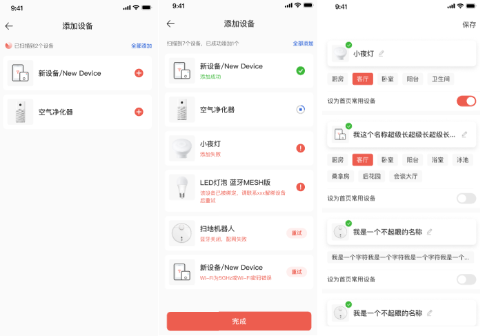

# 微信小程序SDK使用说明

## 一、功能列表
|功能模块 | 
| -------  |  
| 蓝牙配网 |
| 注册、登录、忘记密码、个人中心 |
| 设备管理 | 
| 设备分享 |
| 消息中心 | 
| 设备控制 |
| webSocket接口 |
| 用户域配置 | 
| 主题配置 |

## 二、快速上手
### 1、运行demo
```
1）下载微信开发者工具,下载地址：https://developers.weixin.qq.com/miniprogram/dev/devtools/download.html
2）下载该demo代码至本地，运行npm install
3）在微信开发者工具中导入项目-选择工具-构建npm，即可在模拟器中看到效果
```
### 2、在已有小程序中引用SDK
```
1）在您的小程序代码：app.json文件中
"plugins": {
  "quecPlugin": {
    "version": "1.3.1",
    "provider": "wx5e9a3feb8df9122e"
  }
}

2）如有自己的用户域，在app.js中请设置自己的用户域及密钥，接口如下：
const plugin = requirePlugin('quecPlugin')
plugin.config.setUserDomain('用户域')
plugin.config.setUserDomainSecret('用户域密钥')

3）授权：可将AppID和AppSecret提供给我们进行授权后，点击微信开发者工具-清缓存，然后点击“编译”即可正常运行。
```
### 3、特别说明
```
因微信官方限制,详见：https://developers.weixin.qq.com/miniprogram/dev/framework/open-ability/getPhoneNumber.html,
建议使用企业小程序，个人小程序，手机号信息将无法获取，微信一键登录功能将不能正常使用。
其他登录方式可正常使用。
```

## 三、蓝牙配网
### 1、功能点
```
涵盖功能点：
蓝牙搜索及设备列表、网络配置、网络配置结果;
```
### 2、实现方式
```
提供两种使用方式：
1、含页面布局组件：提供页面及整体配网流程，引用页面组件即可。
2、提供配网js接口，需要使用者根据业务自己编写页面。
```
### 3、含页面布局组件
```
在json文件定义需要引入的自定义组件时,使用plugin://协议指明插件的引用名和自定义组件名。
例如：
{
  "usingComponents": {
    "wifi_scan":"plugin://quecPlugin/wifi_scan", // 蓝牙配网扫描添加
    "wifi_list":"plugin://quecPlugin/wifi_list", // 蓝牙配网添加成功后配置
  }
}
```

组件效果图：


|组件       | 属性    | 说明          |类型  | 默认值 |必填 | 事件 |
| ----      | ----   | ----          |----  |----   |---- | ---- |
| wifi_scan |        |               | -    |-      | -   |Back-返回跳转页面<br>List-设备配置页面      |
| wifi_list |succData| 配网成功的数据 |array |-      | 是   |saveSuccess-保存成功跳转页面   |

### 4、蓝牙配网接口
#### 1) openBle
##### 功能描述
```
初始化蓝牙模块。
```
##### 参数
|属性 | 类型 | 默认值 |必填 |说明 |
| ---- | ---- | ---- |---- |---- |
| success | function |  - | 否 | 接口调用成功的回调函数 |
| fail | function |  - | 否 | 接口调用失败的回调函数 |
| complete | function |  - | 否 | 接口调用结束的回调函数（调用成功、失败都会执行） |

##### 返回码
|Code | 说明 |
| ---- | ---- |
| 200 | 蓝牙初始化成功 |
| 100000 | 手机蓝牙开启失败 |
| 100001 | 手机蓝牙不可用, 请开启蓝牙再试 |
| 100002 | 获取本机蓝牙适配器状态失败 |
| 100003 | 蓝牙搜索功能打开失败 |

##### 示例代码
```
const plugin = requirePlugin('quecPlugin')
 plugin.quecBle.openBle({
    success (res) {
         console.log(res)
     },
     fail (res) {
        console.log(JSON.stringify(res))
      }
 })
```

#### 2) onBLEDeviceFound
##### 功能描述
```
搜索附近的蓝牙设备。
```
##### 参数
|属性 | 类型 | 默认值 |必填 |说明 |
| ---- | ---- | ---- |---- |---- |
| callback | function |  - | 否 | 蓝牙低功耗设备的特征值变化事件的回调函数 |

##### Object.success回调（res）
|属性 | 类型 | 说明 |
| ---- | ---- | ---- |
| devices | Array Object |  搜索到的设备列表 |

##### 示例代码
```
const plugin = requirePlugin('quecPlugin')
plugin.quecBle.onBLEDeviceFound((res)=>{
   console.log(res)
 })
```

#### 3) closeBle
##### 功能描述
```
关闭蓝牙模块。
```
##### 参数
|属性 | 类型 | 默认值 |必填 |说明 |
| ---- | ---- | ---- |---- |---- |
| success | function |  - | 否 | 接口调用成功的回调函数 |
| fail | function |  - | 否 | 接口调用失败的回调函数 |
| complete | function |  - | 否 | 接口调用结束的回调函数（调用成功、失败都会执行） |

##### 返回码
|Code | 说明 |
| ---- | ---- |
| 200 | 蓝牙模块关闭成功 |
| 100014 | 蓝牙模块关闭失败 |

##### 示例代码
```
const plugin = requirePlugin('quecPlugin')
 plugin.quecBle.closeBle({
    success (res) {
         console.log(res)
     },
     fail (res) {
        console.log(JSON.stringify(res))
      }
 })
```

#### 4) stopBleScan
##### 功能描述
```
停止搜寻附近的蓝牙外围设备。
```
##### 参数
|属性 | 类型 | 默认值 |必填 |说明 |
| ---- | ---- | ---- |---- |---- |
| success | function |  - | 否 | 接口调用成功的回调函数 |
| fail | function |  - | 否 | 接口调用失败的回调函数 |
| complete | function |  - | 否 | 接口调用结束的回调函数（调用成功、失败都会执行） |

##### 返回码
|Code | 说明 |
| ---- | ---- |
| 200 | 附近的蓝牙外围设备搜寻停止成功 |
| 100015 | 附近的蓝牙外围设备搜寻停止失败 |

##### 示例代码
```
const plugin = requirePlugin('quecPlugin')
 plugin.quecBle.stopBleScan({
    success (res) {
         console.log(res)
     },
     fail (res) {
        console.log(JSON.stringify(res))
      }
 })
```

#### 5) connectBLE
##### 功能描述
```
连接蓝牙低功耗设备。
```

##### 参数
|属性 | 类型 | 默认值 |必填 |说明 |
| ---- | ---- | ---- |---- |---- |
| deviceId | string |  - | 是 | 蓝牙设备 id |
| openDeviceFound | boolean |  false | 否 | 开启搜寻附近的蓝牙外围设备（如不是通过蓝牙搜索获取的deviceId,请传true） |
| timeout | number |  - | 否 | 超时时间，单位 ms，不填表示不会超时 |
| success | function |  - | 否 | 接口调用成功的回调函数 |
| fail | function |  - | 否 | 接口调用失败的回调函数 |
| complete | function |  - | 否 | 接口调用结束的回调函数（调用成功、失败都会执行） |

##### Object.success回调（res）
|属性 | 类型 | 说明 |
| ---- | ---- | ---- |
| serviceId | string |  设备服务ID | 
| characteristicId | string |  设备特征ID | 

##### 返回码
|Code | 说明 |
| ---- | ---- |
| 200 | 蓝牙初始化成功 |
| 100000 | 手机蓝牙开启失败 |
| 100001 | 手机蓝牙不可用, 请开启蓝牙再试 |
| 100002 | 获取本机蓝牙适配器状态失败 |
| 100003 | 蓝牙搜索功能打开失败 |
| 100005 | 连接蓝牙失败 |
| 100006 | 蓝牙获取失败 |
| 100007 | 获取特征值失败 |
| 100013 | 设备不存在 |

##### 示例代码
```
const plugin = requirePlugin('quecPlugin')
 plugin.quecBle.connectBLE({
     deviceId:"",
    success (res) {
         console.log(res)
     },
     fail (res) {
        console.log(JSON.stringify(res))
      }
 })
```

#### 6) openNotifyBLE
##### 功能描述
```
启用蓝牙低功耗设备特征值变化时的 otify功能，订阅特征。
注意：必须设备的特征支持 notify 或者 indicate 才可以成功调用。
另外，必须先启用 wx.notifyBLECharacteristicValueChange才能监听到设备 characteristicValueChange 事件。
```

##### 参数
|属性 | 类型 | 默认值 |必填 |说明 |
| ---- | ---- | ---- |---- |---- |
| deviceId | string |  - | 是 | 蓝牙设备 id |
| serviceId | string |  - | 是 | 蓝牙特征对应服务的 UUID |
| characteristicId | string |  - | 是 | 蓝牙特征的 UUID |
| state | boolean |  true | 是 | 是否启用 notify |
| type | string |  indication | 是 | 设置特征订阅类型，有效值有 notification 和 indication |
| success | function |  - | 否 | 接口调用成功的回调函数 |
| fail | function |  - | 否 | 接口调用失败的回调函数 |
| complete | function |  - | 否 | 接口调用结束的回调函数（调用成功、失败都会执行） |

##### Object.success回调（res）
|属性 | 类型 | 说明 |
| ---- | ---- | ---- |
| serviceId | string |  设备服务ID |
| characteristicId | string |  设备特征ID |

##### 返回码
|Code | 说明 |
| ---- | ---- |
| 200 | 启用低功耗蓝牙设备特征值变化时的notify功能成功 |
| 100008 | 启用低功耗蓝牙设备特征值变化时的notify功能失败 |

##### 示例代码
```
const plugin = requirePlugin('quecPlugin')
 plugin.quecBle.openNotifyBLE({
     deviceId:'',
     serviceId:'',
     characteristicId:'',
     state:true,
     type:'notification',
    success (res) {
         console.log(res)
     },
     fail (res) {
        console.log(JSON.stringify(res))
      }
 })
```

#### 7) writeBLECharacteristicValue
##### 功能描述
```
向蓝牙低功耗设备特征值中写入二进制数据。
注意：必须设备的特征支持 write 才可以成功调用。
```

##### 参数
|属性 | 类型 | 默认值 |必填 |说明 |
| ---- | ---- | ---- |---- |---- |
| deviceId | string |  - | 是 | 蓝牙设备 id |
| serviceId | string |  - | 是 | 蓝牙特征对应服务的 UUID |
| characteristicId | string |  - | 是 | 蓝牙特征的 UUID |
| ssid | string |  - | 是 | Wi-Fi 的 SSID |
| password | string |  - | 是 | Wi-Fi 设备密码 |
| isNew | boolean |  'old' | 否 | 是否是新固件（默认老固件） |
| writeType | string |  - | 否 | 蓝牙特征值的写模式设置，有两种模式，iOS 优先 write，安卓优先 writeNoResponse(基础库 2.22.0 开始支持） |
| success | function |  - | 否 | 接口调用成功的回调函数 |
| fail | function |  - | 否 | 接口调用失败的回调函数 |
| complete | function |  - | 否 | 接口调用结束的回调函数（调用成功、失败都会执行） |

##### Object.success回调（res）
|属性 | 类型 | 说明 |
| ---- | ---- | ---- |
| networkState | number |  1表示写入成功 |

##### 返回码
|Code | 说明 |
| ---- | ---- |
| 100009 | 写入数据失败 |

##### 示例代码
```
const plugin = requirePlugin('quecPlugin')
 plugin.quecBle.writeBLECharacteristicValue({
     deviceId:'',
     serviceId:'',
     characteristicId:'',
     ssid:'',
     password:'',
    success (res) {
         console.log(res)
     },
     fail (res) {
        console.log(JSON.stringify(res))
      }
 })
```

#### 8) onBLECharacteristicValueChange
##### 功能描述
```
监听蓝牙低功耗设备的特征值变化事件。
必须先调用 openNotifyBLE 接口才能接收到设备推送的绑定信息。
```
##### 参数
|属性 | 类型 | 默认值 |必填 |说明 |
| ---- | ---- | ---- |---- |---- |
| success | function |  - | 否 | 接口调用成功的回调函数 |
| fail | function |  - | 否 | 接口调用失败的回调函数 |
| complete | function |  - | 否 | 接口调用结束的回调函数（调用成功、失败都会执行） |

##### Object.success回调（res）
|属性 | 类型 | 说明 |
| ---- | ---- | ---- |
| productKey | string |  产品Productkey |
| deviceKey | string|  设备Devicekey |
| bindCode |string |  绑定信息 |
| networkState |number |  2 表示配网成功 |

##### 返回码
|Code | 说明 |
| ---- | ---- |
| 100011 | 低功耗蓝牙设备的特征值监听失败 |

##### 示例代码
```
const plugin = requirePlugin('quecPlugin')
 plugin.quecBle.onBLECharacteristicValueChange({
    success (res) {
         console.log(res)
     },
     fail (res) {
        console.log(JSON.stringify(res))
      }
 })
```

#### 9) closeBLEConnection
##### 功能描述
```
断开与蓝牙低功耗设备的连接。
```

##### 参数
|属性 | 类型 | 默认值 |必填 |说明 |
| ---- | ---- | ---- |---- |---- |
| deviceId | string |  - | 是 | 蓝牙设备id |
| success | function |  - | 否 | 接口调用成功的回调函数 |
| fail | function |  - | 否 | 接口调用失败的回调函数 |
| complete | function |  - | 否 | 接口调用结束的回调函数（调用成功、失败都会执行） |

##### 返回码
|Code | 说明 |
| ---- | ---- |
| 100010 | 低功耗蓝牙设备的连接断开失败 |

##### 示例代码
```
const plugin = requirePlugin('quecPlugin')
 plugin.quecBle.closeBLEConnection({
     deviceId:'',
    success (res) {
         console.log(res)
     },
     fail (res) {
        console.log(JSON.stringify(res))
      }
 })
```

#### 10) getCurentWifi
##### 功能描述
```
获取当前已连接wifi信息。
```

##### 参数
|属性 | 类型 | 默认值 |必填 |说明 |
| ---- | ---- | ---- |---- |---- |
| success | function |  - | 否 | 接口调用成功的回调函数 |
| fail | function | - | 否 | 接口调用失败的回调函数 |
| complete | function |  - | 否 | 接口调用结束的回调函数（调用成功、失败都会执行） |

##### Object.success回调（res）
|属性 | 类型 | 说明 |
| ---- | ---- | ---- |
| ssid | string |  Wi-Fi 的 SSID |

##### 返回码
|Code | 说明 |
| ---- | ---- |
| 100004 | wifi获取失败 |

##### 示例代码
```
const plugin = requirePlugin('quecPlugin')
 plugin.quecBle.getCurentWifi({
    success (res) {
         console.log(res)
     },
     fail (res) {
        console.log(JSON.stringify(res))
      }
 })
```

#### 11) closeWifi
##### 功能描述
```
关闭Wi-Fi模块。
```

##### 参数
|属性 | 类型 | 默认值 |必填 |说明 |
| ---- | ---- | ---- |---- |---- |
| success | function |  - | 否 | 接口调用成功的回调函数 |
| fail | function |  - | 否 | 接口调用失败的回调函数 |
| complete | function |  - | 否 | 接口调用结束的回调函数（调用成功、失败都会执行） |

##### 返回码
|Code | 说明 |
| ---- | ---- |
| 200 | wiFi模块关闭成功 |
| 100012 | wiFi模块关闭失败 |

##### 示例代码
```
const plugin = requirePlugin('quecPlugin')
 plugin.quecBle.closeWifi({
    success (res) {
         console.log(res)
     },
     fail (res) {
        console.log(JSON.stringify(res))
      }
 })
```

#### 12) openBleAndLoc
##### 功能描述
```
开启蓝牙模块。(含开启蓝牙及定位权限)
```

##### 参数
|属性 | 类型 | 默认值 |必填 |说明 |
| ---- | ---- | ---- |---- |---- |
| success | function |  - | 否 | 接口调用成功的回调函数 |
| fail | function |  - | 否 | 接口调用失败的回调函数 |
| complete | function |  - | 否 | 接口调用结束的回调函数（调用成功、失败都会执行） |

##### 返回码
|Code | 说明 |
| ---- | ---- |
| 200 | wiFi模块关闭成功 |
| 100012 | wiFi模块关闭失败 |

##### 示例代码
```
const plugin = requirePlugin('quecPlugin')
 plugin.quecBle.openBleAndLoc({
    success (res) {
         console.log(res)
     },
     fail (res) {
        console.log(JSON.stringify(res))
      }
 })
```

#### 13) onBLEDeviceFoundV2
##### 功能描述
```
搜索附近的蓝牙设备。（解析蓝牙设备的广播数据段中pk、dk）
```
##### 参数
|属性 | 类型 | 默认值 |必填 |说明 |
| ---- | ---- | ---- |---- |---- |
| callback | function |  - | 否 | 蓝牙低功耗设备的特征值变化事件的回调函数 |

##### Object.success回调（res）
|属性 | 类型 | 说明 |
| ---- | ---- | ---- |
| devices | Array Object |  搜索到的设备列表 |

##### 示例代码
```
const plugin = requirePlugin('quecPlugin')
plugin.quecBle.onBLEDeviceFoundV2((res)=>{
   console.log(res)
 })
```

#### 14) getBluetoothStateChange
##### 功能描述
```
监听蓝牙适配器状态变化事件。
```
##### 参数
|属性 | 类型 | 默认值 |必填 |说明 |
| ---- | ---- | ---- |---- |---- |
| success | function |  - | 否 | 接口调用成功的回调函数 |
| fail | function |  - | 否 | 接口调用失败的回调函数 |
| complete | function |  - | 否 | 接口调用结束的回调函数（调用成功、失败都会执行） |

##### 示例代码
```
const plugin = requirePlugin('quecPlugin')
plugin.quecBle.getBluetoothStateChange({
  success (res) {
      console.log(res)
  },
  fail (res) {
    console.log(JSON.stringify(res))
  }
})
```

#### 15) connectWifi
##### 功能描述
```
连接wifi。（跳转到wifi系统设置页面）
```
##### 参数
|属性 | 类型 | 默认值 |必填 |说明 |
| ---- | ---- | ---- |---- |---- |
| SSID | string |  - | 是 | Wi-Fi设备SSID |
| password | string |  - | 是 | Wi-Fi设备密码 |
| success | function |  - | 否 | 接口调用成功的回调函数 |
| fail | function |  - | 否 | 接口调用失败的回调函数 |
| complete | function |  - | 否 | 接口调用结束的回调函数（调用成功、失败都会执行） |

##### 示例代码
```
const plugin = requirePlugin('quecPlugin')
plugin.quecBle.connectWifi({
  SSID:'',
  password:'',
  success (res) {
    console.log(res)
  },
  fail (res) {
    console.log(JSON.stringify(res))
  }
})
```

#### 16) onBLECharacteristicValueChangeV2
##### 功能描述
```
监听蓝牙低功耗设备的特征值变化事件。（兼容新、老固件）
必须先调用 openNotifyBLE 接口才能接收到设备推送的绑定信息。
```
##### 参数
|属性 | 类型 | 默认值 |必填 |说明 |
| ---- | ---- | ---- |---- |---- |
| isNew | boolean |  'old' | 否 | 是否是新固件（默认老固件） |
| success | function |  - | 否 | 接口调用成功的回调函数 |
| fail | function |  - | 否 | 接口调用失败的回调函数 |
| complete | function |  - | 否 | 接口调用结束的回调函数（调用成功、失败都会执行） |

##### Object.success回调（res）
|属性 | 类型 | 说明 |
| ---- | ---- | ---- |
| productKey | string |  产品Productkey |
| deviceKey | string|  设备Devicekey |
| bindCode |string |  绑定信息 |
| networkState |number |  2 表示配网成功 |

##### 返回码
|Code | 说明 |
| ---- | ---- |
| 100011 | 低功耗蓝牙设备的特征值监听失败 |

##### 示例代码
```
const plugin = requirePlugin('quecPlugin')
 plugin.quecBle.onBLECharacteristicValueChangeV2({
    success (res) {
         console.log(res)
     },
     fail (res) {
        console.log(JSON.stringify(res))
      }
 })
```

## 四、注册、登录、忘记密码、个人中心
### 1、功能点
```
涵盖功能点：
1、手机号/邮箱注册
2、手机号/邮箱密码登录、微信一键登录、验证码登录
3、手机号/邮箱忘记密码
4、个人信息-展示、修改头像、修改昵称、修改密码、注销账户、退出登录;
6、关于- 标题、版本、电话（点击可拨打）
```

### 2、微信一键登录具体实现
```
在插件开发中，部分API受限制，无法在插件中直接使用，如：获取用户信息，获取用户号码等，因此微信一键登录组件，采用抽象节点的方式实现。
1)小程序miniprogram端app.json中，配置插件信息
  "plugins": {
    "quecPlugin": {
      "version": "1.3.1",
      "provider": "wx5e9a3feb8df9122e"
    }
  }

2)小程序miniprogram端components中新建wx_info组件，将用户信息getUserInfo及手机号信息getPhoneNumber通过事件绑定传递出去,同时设置如下属性：
phoneVisible-是否展示获取用户号码授权弹框
isCheck-是否勾选用户协议

3）小程序端页面调用：
json文件中配置
"usingComponents": {
  "wx_login": "plugin://quecPlugin/wx_login",
  "wx_info": "../../components/wx_info/index"
}
wxml文件中：
 <wx_login generic:wx_info="wx_info" agreecheck="{{checked}}" bindwxLoginSuccess="loginResult"></wx_login>
```

### 3、注册、登录、忘记密码、个人中心接口
#### 1) wxLogin 
##### 功能描述
```
微信一键登录。
```
##### 参数
|属性 | 类型 | 默认值 |必填 |说明 |
| ---- | ---- | ---- |---- |---- |
| appId | string |  - | 是 | 微信appId |
| authorizedMobliePhone | boolean |  true | 是 | 是否需要用户授权手机号，默认为true |
| authorizedUserInfo | boolean |  true | 是 | 是否需要用户授权用户信息，默认为true |
| wxCode | string |  - | 是 | 微信授权Code |
| wxUserInfoDecrypData | object |  - | 否 | 微信用户信息加密信息(encryptedData、iv) |
| random | string |  - | 否 | 随机数 |
| wxPhoneDecryptData | object |  - | 否 | 手机号加密信息(encryptedData、iv) |
| success | function |  - | 否 | 接口调用成功的回调函数 |
| fail | function |  - | 否 | 接口调用失败的回调函数 |
| complete | function |  - | 否 | 接口调用结束的回调函数（调用成功、失败都会执行） |
##### 示例代码
```
const plugin = requirePlugin('quecPlugin')
第一次调用拿到random
 plugin.quecUser.wxLogin({
     appId:appId,
     authorizedMobliePhone: true,
     authorizedUserInfo: true,
     wxCode: wxCode,
     success (res) {
         console.log(res)
     },
     fail (res) {
        console.log(JSON.stringify(res))
      }
 })
 
 第二次调用，传递random，wxUserInfoDecrypData，wxPhoneDecryptData
 plugin.quecUser.wxLogin({
     appId:appId,
     authorizedMobliePhone: true,
     authorizedUserInfo: true,
     wxCode: wxCode,
     wxUserInfoDecrypData:wxUserInfoDecrypData,
     wxPhoneDecryptData:wxPhoneDecryptData,
     random:random
     success (res) {
         console.log(res)
     },
     fail (res) {
        console.log(JSON.stringify(res))
      }
 })
```

#### 2) sendPhoneSmsCode
##### 功能描述
```
发送手机短信验证码。
```
##### 参数
| 属性   | 类型     | 默认值 | 必填 | 说明           |
| ------ | -------- | ------ | ---- | --------------|
| phone | string   | - | 是   | 手机号  |
| ssid  | string   | - |  是 | 企业短信签名ID  ('C1'-阿里云)                                            |
| stid  | string  |  - | 是 | 企业短信模板ID ( 'C1'-国内忘记密码<br>'C2'-国内登录<br>'C3'-国内注册<br> 'C7'- 国内账号注销 |
| success  | function | -  | 否   | 接口调用成功的回调函数                           |
| fail     | function | -  | 否   | 接口调用失败的回调函数                           |
| complete | function | -  | 否   | 接口调用结束的回调函数（调用成功、失败都会执行） |

##### 示例代码
```
const plugin = requirePlugin('quecPlugin')
 plugin.quecUser.sendPhoneSmsCode({
    phone: '180xxxx',
    ssid: 'C1',
    stid: 'C3',
    success (res) {
         console.log(res)
     },
     fail (res) {
        console.log(JSON.stringify(res))
      }
 })
```

#### 3) validateSmsCode
##### 功能描述
```
验证短信验证码。
```
##### 参数
| 属性              | 类型     | 默认值 | 必填 | 说明                                             |
| ----------------- | -------- | ------ | ---- | ------------------------------------------------ |
| phone             | string   | -      | 是   | 手机号                                           |
| smsCode           | string   | -      | 是   | 短信验证码                                       |
| isDisabled        | number   |    1   | 否   | 验证码验证后是否失效，1：失效 2：不失效，默认 1   |
| success           | function | -      | 否   | 接口调用成功的回调函数                           |
| fail              | function | -      | 否   | 接口调用失败的回调函数                           |
| complete          | function | -      | 否   | 接口调用结束的回调函数（调用成功、失败都会执行） |

##### 示例代码
```
const plugin = requirePlugin('quecPlugin')
 plugin.quecUser.validateSmsCode({
    phone: '180xxxxx',
    smsCode: '123542',
    isDisabled:2,
    success (res) {
         console.log(res)
     },
     fail (res) {
        console.log(JSON.stringify(res))
      }
 })
```

#### 4) isPhoneRegister
##### 功能描述
```
验证手机号是否注册。
```
##### 参数
| 属性              | 类型     | 默认值 | 必填 | 说明                                             |
| ----------------- | -------- | ------ | ---- | ------------------------------------------------ |
| phone             | string   | -      | 是   | 手机号                                           |
| success           | function | -      | 否   | 接口调用成功的回调函数                           |
| fail              | function | -      | 否   | 接口调用失败的回调函数                           |
| complete          | function | -      | 否   | 接口调用结束的回调函数（调用成功、失败都会执行） |

##### 示例代码
```
const plugin = requirePlugin('quecPlugin')
 plugin.quecUser.isPhoneRegister({
    phone: '180xxxxxxxx',
    success (res) {
         console.log(res)
     },
     fail (res) {
        console.log(JSON.stringify(res))
      }
 })
```

#### 5) phonePwdRegister
##### 功能描述
```
手机号注册。
```
##### 参数
| 属性              | 类型     | 默认值 | 必填 | 说明                                             |
| ----------------- | -------- | ------ | ---- | ------------------------------------------------ |
| phone             | string   | -      | 是   | 手机号                                           |
| pwd               |    string      |    -    |   是   |         密码                            |
| smsCode           |  string        |  -      |   是   |      验证码                             |
| success           | function | -      | 否   | 接口调用成功的回调函数                           |
| fail              | function | -      | 否   | 接口调用失败的回调函数                           |
| complete          | function | -      | 否   | 接口调用结束的回调函数（调用成功、失败都会执行） |

##### 示例代码
```
const plugin = requirePlugin('quecPlugin')
 plugin.quecUser.phonePwdRegister({
    phone: '180xxxxx',
    pwd:'a123456',
    smsCode:'210320',
    success (res) {
         console.log(res)
     },
     fail (res) {
        console.log(JSON.stringify(res))
      }
 })
```

#### 6) phonePwdLogin
##### 功能描述
```
手机号密码登录。
```
##### 参数
| 属性              | 类型     | 默认值 | 必填 | 说明                                             |
| ----------------- | -------- | ------ | ---- | ------------------------------------------------ |
| internationalCode | string   | '86'   | 否   | 国家码                                           |
| phone             | string   | -      | 是   | 手机号                                           |
| pwd               |    string      |    -    |   是   |         密码                                         |
| success           | function | -      | 否   | 接口调用成功的回调函数                           |
| fail              | function | -      | 否   | 接口调用失败的回调函数                           |
| complete          | function | -      | 否   | 接口调用结束的回调函数（调用成功、失败都会执行） |

##### 示例代码
```
const plugin = requirePlugin('quecPlugin')
 plugin.quecUser.phonePwdLogin({
    phone: '180xxxxxx',
    pwd:'a123456',
    success (res) {
         console.log(res)
     },
     fail (res) {
        console.log(JSON.stringify(res))
      }
 })
```

#### 7) phoneSmsCodeLogin
##### 功能描述
```
手机号验证码登录。
```
##### 参数
| 属性              | 类型     | 默认值 | 必填 | 说明                                             |
| ----------------- | -------- | ------ | ---- | ------------------------------------------------ |
| phone             | string   | -      | 是   | 手机号                                           |
| smsCode           | string   | -      | 是   | 验证码                                     |
| success           | function | -      | 否   | 接口调用成功的回调函数                           |
| fail              | function | -      | 否   | 接口调用失败的回调函数                           |
| complete          | function | -      | 否   | 接口调用结束的回调函数（调用成功、失败都会执行） |

##### 示例代码
```
const plugin = requirePlugin('quecPlugin')
 plugin.quecUser.phoneSmsCodeLogin({
    phone: '180xxxxxx',
    smsCode:'120321',
    success (res) {
         console.log(res)
     },
     fail (res) {
        console.log(JSON.stringify(res))
      }
 })
```

#### 8) sendEmailRegisterCode
##### 功能描述
```
发送邮件注册验证码。
```
##### 参数
| 属性              | 类型     | 默认值 | 必填 | 说明                                             |
| ----------------- | -------- | ------ | ---- | ------------------------------------------------ |
| email             | string   | -      | 是   | 邮箱                                           |
| success           | function | -      | 否   | 接口调用成功的回调函数                           |
| fail              | function | -      | 否   | 接口调用失败的回调函数                           |
| complete          | function | -      | 否   | 接口调用结束的回调函数（调用成功、失败都会执行） |

##### 示例代码
```
const plugin = requirePlugin('quecPlugin')
 plugin.quecUser.sendEmailRegisterCode({
    email: 'daney.hong@quectel.com',
    success (res) {
         console.log(res)
     },
     fail (res) {
        console.log(JSON.stringify(res))
      }
 })
```

#### 9) emailPwdRegister
##### 功能描述
```
邮箱注册。
```
##### 参数
| 属性              | 类型     | 默认值 | 必填 | 说明                                         |
| ----------------- | --------| ------ | ---- | ------------------------------------------- |
| email             | string   | -     | 是   | 邮箱                                         |
| pwd               | string   | -     | 是   | 密码                                         |
| code              | string   | -     | 是   | 验证码                                       |
| success           | function | -     | 否   | 接口调用成功的回调函数                         |
| fail              | function | -     | 否   | 接口调用失败的回调函数                         |
| complete          | function | -     | 否   | 接口调用结束的回调函数（调用成功、失败都会执行） |

##### 示例代码
```
const plugin = requirePlugin('quecPlugin')
 plugin.quecUser.emailPwdRegister({
    email: 'daney.hong@quectel.com',
    pwd:'a123456',
    code:'160210',
    success (res) {
         console.log(res)
     },
     fail (res) {
        console.log(JSON.stringify(res))
      }
 })
```

#### 10) emailPwdLogin
##### 功能描述
```
邮箱密码登录。
```
##### 参数
| 属性              | 类型     | 默认值 | 必填 | 说明                                             |
| ----------------- | -------- | ------ | ---- | ------------------------------------------------ |
| email             | string   | -      | 是   | 邮箱                                       |
| pwd               |    string      |    -    |   是   |         密码                                         |
| success           | function | -      | 否   | 接口调用成功的回调函数                           |
| fail              | function | -      | 否   | 接口调用失败的回调函数                           |
| complete          | function | -      | 否   | 接口调用结束的回调函数（调用成功、失败都会执行） |

##### 示例代码
```
const plugin = requirePlugin('quecPlugin')
 plugin.quecUser.emailPwdLogin({
    email: 'daney.hong@quectel.com',
    pwd:'a123456',
    success (res) {
         console.log(res)
     },
     fail (res) {
        console.log(JSON.stringify(res))
      }
 })
```

#### 11) sendEmailRepwdCode
##### 功能描述
```
发送邮件重置验证码。
```
##### 参数
| 属性              | 类型     | 默认值 | 必填 | 说明                                             |
| ----------------- | -------- | ------ | ---- | ------------------------------------------------ |
| email             | string   | -      | 是   | 邮箱                                       |
| success           | function | -      | 否   | 接口调用成功的回调函数                           |
| fail              | function | -      | 否   | 接口调用失败的回调函数                           |
| complete          | function | -      | 否   | 接口调用结束的回调函数（调用成功、失败都会执行） |

##### 示例代码
```
const plugin = requirePlugin('quecPlugin')
 plugin.quecUser.sendEmailRepwdCode({
    email: 'daney.hong@quectel.com',
    success (res) {
         console.log(res)
     },
     fail (res) {
        console.log(JSON.stringify(res))
      }
 })
```

#### 12) userPwdReset
##### 功能描述
```
通过手机号码或邮箱重置用户密码。（手机号码或邮箱 二选一）
```
##### 参数
| 属性     | 类型     | 默认值 | 必填 | 说明                                             |
| -------- | -------- | ------ | ---- | ------------------------------------------------ |
| code     | string   | -      | 是   | 验证码                                           |
| email    |   string      | -       |    否  |        邮箱                                          |
| phone    |    string      |-        |   否   |       手机号                                           |
| pwd      |  string        |     -   |   否   |          密码                                        |
| internationalCode         |    string     |    ‘86’   |    否  |       国家码                                          |
| success  | function | -      | 否   | 接口调用成功的回调函数                           |
| fail     | function | -      | 否   | 接口调用失败的回调函数                           |
| complete | function | -      | 否   | 接口调用结束的回调函数（调用成功、失败都会执行） |

##### 示例代码
```
const plugin = requirePlugin('quecPlugin')
 plugin.quecUser.userPwdReset({
    email: 'daney.hong@quectel.com',
    code:'321010',
    success (res) {
         console.log(res)
     },
     fail (res) {
        console.log(JSON.stringify(res))
      }
 })
```

#### 13) validateEmailCode
##### 功能描述
```
验证邮箱短信验证码是否有效
```
##### 参数
| 属性     | 类型     | 默认值 | 必填 | 说明                                             |
| -------- | -------- | ------ | ---- | ------------------------------------------------ |
| code     | string   | -      | 是   | 验证码                                           |
| email    |   string      | -       |    否  |        邮箱                                          |
| isDisabled                  |    number      |    1    |   否   | 验证码验证后是否失效，1：失效 2：不失效，默认 1   |
| success  | function | -      | 否   | 接口调用成功的回调函数                           |
| fail     | function | -      | 否   | 接口调用失败的回调函数                           |
| complete | function | -      | 否   | 接口调用结束的回调函数（调用成功、失败都会执行） |

##### 示例代码
```
const plugin = requirePlugin('quecPlugin')
plugin.quecUser.validateEmailCode({
   code: '123456',
   email: 'xx@qq.com',
   isDisabled: 2,
   success (res) {
        console.log(res)
   },
  fail (res) {
    console.log(JSON.stringify(res))
  }
 })
```

#### 14) sendEmail
##### 功能描述
```
发送邮件验证码(注销/关联手机号)
```
##### 参数
| 属性     | 类型     | 默认值  | 必填 | 说明                                             |
| --------| -------- | ------ | ---- | ------------------------------------------------ |
| email    | string   | -      | 是  |  收件人邮箱                                        |
| success  | function | -      | 否   | 接口调用成功的回调函数                           |
| fail     | function | -      | 否   | 接口调用失败的回调函数                           |
| complete | function | -      | 否   | 接口调用结束的回调函数（调用成功、失败都会执行） |

##### 示例代码
```
const plugin = requirePlugin('quecPlugin')
plugin.quecUser.sendEmail({
   email: 'xx@xx.com',
   success (res) {
        console.log(res)
   },
  fail (res) {
    console.log(JSON.stringify(res))
  }
 })
```

#### 15) getUInfo
##### 功能描述
```
获取用户信息。
```
##### 参数
|属性 | 类型 | 默认值 |必填 |说明 |
| ---- | ---- | ---- |---- |---- |
| success | function |  - | 否 | 接口调用成功的回调函数 |
| fail | function |  - | 否 | 接口调用失败的回调函数 |
| complete | function |  - | 否 | 接口调用结束的回调函数（调用成功、失败都会执行） |

##### 示例代码
```
const plugin = requirePlugin('quecPlugin')
 plugin.quecUser.getUInfo({
     success (res) {
        console.log(res)
     },
     fail (res) {
        console.log(JSON.stringify(res))
      }
 })
```

#### 16) userLogout 
##### 功能描述
```
退出登录。
```
##### 参数
|属性 | 类型 | 默认值 |必填 |说明 |
| ---- | ---- | ---- |---- |---- |
| success | function |  - | 否 | 接口调用成功的回调函数 |
| fail | function |  - | 否 | 接口调用失败的回调函数 |
| complete | function |  - | 否 | 接口调用结束的回调函数（调用成功、失败都会执行） |

##### 示例代码
```
const plugin = requirePlugin('quecPlugin')
 plugin.quecUser.userLogout({
     success (res) {
         console.log(res)
     },
     fail (res) {
        console.log(JSON.stringify(res))
      }
 })
```

#### 17) userCancel 
##### 功能描述
```
用户注销。
```
##### 参数
|属性 | 类型 | 默认值 |必填 |说明 |
| ---- | ---- | ---- |---- |---- |
| type | number |  默认为 7 天后删除 | 否 | 删除类型：1- 立即删除<br> 2- 7天后删除 |
| success | function |  - | 否 | 接口调用成功的回调函数 |
| fail | function |  - | 否 | 接口调用失败的回调函数 |
| complete | function |  - | 否 | 接口调用结束的回调函数（调用成功、失败都会执行） |
##### 示例代码
```
const plugin = requirePlugin('quecPlugin')
 plugin.quecUser.userCancel({
     type:1,
     success (res) {
         console.log(res)
     },
     fail (res) {
        console.log(JSON.stringify(res))
      }
 })
```

#### 18) editNickname 
##### 功能描述
```
修改昵称。
```
##### 参数
|属性 | 类型 | 默认值 |必填 |说明 |
| ---- | ---- | ---- |---- |---- |
| nikeName | string |  - | 是 | 昵称 |
| success | function |  - | 否 | 接口调用成功的回调函数 |
| fail | function |  - | 否 | 接口调用失败的回调函数 |
| complete | function |  - | 否 | 接口调用结束的回调函数（调用成功、失败都会执行） |
##### 示例代码
```
const plugin = requirePlugin('quecPlugin')
 plugin.quecUser.editNickname({
     nikeName:'示例名称',
     success (res) {
         console.log(res)
     },
     fail (res) {
        console.log(JSON.stringify(res))
      }
 })
```

#### 19) editHeadImg 
##### 功能描述
```
修改头像。
```
##### 参数
|属性 | 类型 | 默认值 |必填 |说明 |
| ---- | ---- | ---- |---- |---- |
| headImage | String |  - | 是 | 修改头像地址 |
| success | function |  - | 否 | 接口调用成功的回调函数 |
| fail | function |  - | 否 | 接口调用失败的回调函数 |
| complete | function |  - | 否 | 接口调用结束的回调函数（调用成功、失败都会执行） |
##### 示例代码
```
const plugin = requirePlugin('quecPlugin')
 plugin.quecUser.editHeadImg({
    headImage:'',
    success (res) {
      console.log(res)
    },
    fail (res) {
     console.log(JSON.stringify(res))
  }
 })
```

#### 20) relationPhone 
##### 功能描述
```
关联手机号。
```
##### 参数
| 属性     | 类型     | 默认值 | 必填 | 说明                                            |
| -------- | -------- | ------ | ---- | ----------------------------------------------|
| code   |  string    |  -     |   是   |    验证码  |
| phone  | string  | -    |   是   |   手机号   |
| success  | function | -      | 否   | 接口调用成功的回调函数                           |
| fail     | function | -      | 否   | 接口调用失败的回调函数                           |
| complete | function | -      | 否   | 接口调用结束的回调函数（调用成功、失败都会执行）    |

##### 示例代码
```
const plugin = requirePlugin('quecPlugin')
 plugin.quecUser.relationPhone({
     code:'123456',
     phone:'180xxxxxxxx',
     success (res) {
         console.log(res)
     },
     fail (res) {
        console.log(JSON.stringify(res))
      }
 })
```

#### 21) isEmailRegister 
##### 功能描述
```
邮箱是否注册
```
##### 参数
| 属性     | 类型     | 默认值 | 必填 | 说明                                            |
| -------- | -------- | ------ | ---- | ----------------------------------------------|
| email   |  string    |  -    |   是   |    邮箱  |
| success  | function | -      | 否   | 接口调用成功的回调函数                           |
| fail     | function | -      | 否   | 接口调用失败的回调函数                           |
| complete | function | -      | 否   | 接口调用结束的回调函数（调用成功、失败都会执行）    |

##### 示例代码
```
const plugin = requirePlugin('quecPlugin')
 plugin.quecUser.isEmailRegister({
     code:'123456',
     phone:'180xxxxxxxx',
     success (res) {
         console.log(res)
     },
     fail (res) {
        console.log(JSON.stringify(res))
      }
 })
```


## 五、设备管理
### 1、功能点
```
涵盖功能点：设备扫描安装、设备列表（展示、重命名、删除）、设备搜索
```

### 2、设备管理接口
#### 1) scan 
##### 功能描述
```
设备安装二维码扫描。
```
##### 参数
|属性 | 类型 | 默认值 |必填 |说明 |
| ---- | ---- | ---- |---- |---- |
| success | function |  - | 否 | 接口调用成功的回调函数 |
| fail | function |  - | 否 | 接口调用失败的回调函数 |
| complete | function |  - | 否 | 接口调用结束的回调函数（调用成功、失败都会执行） |
##### 返回码
|Code | 说明 | 
| ---- | ---- | 
| 110000 | 二维码不正确，请重新扫描 | 

##### 示例代码
```
const plugin = requirePlugin('quecPlugin')
 plugin.quecManage.scan({
    success (res) {
         console.log(res)
     },
     fail (res) {
        console.log(JSON.stringify(res))
      }
 })
```

#### 2) bindSubmit 
##### 功能描述
```
添加设备。
```
##### 参数
|属性 | 类型 | 默认值 |必填 |说明 |
| ---- | ---- | ---- |---- |---- |
| pk | String |  - | 是 | 产品productKey |
| sn | String |  - | 是 | 设备sn |
| deviceName | String |  - | 是 | 设备名称 |
| success | function |  - | 否 | 接口调用成功的回调函数 |
| fail | function |  - | 否 | 接口调用失败的回调函数 |
| complete | function |  - | 否 | 接口调用结束的回调函数（调用成功、失败都会执行） |

##### 返回码
|Code | 说明 | 
| ---- | ---- | 
| 200 | 设备添加成功 | 

##### 示例代码
```
const plugin = requirePlugin('quecPlugin')
 plugin.quecManage.bindSubmit({
     pk:'',
     sn:'',
     deviceName:'',
    success (res) {
         console.log(res)
     },
     fail (res) {
        console.log(JSON.stringify(res))
      }
 })
```

#### 3) getDeviceList 
##### 功能描述
```
获取设备列表。
```
##### 参数
|属性 | 类型 | 默认值 |必填 |说明 |
| ---- | ---- | ---- |---- |---- |
| page | number |  - | 是 | 页码 |
| pageSize | number |  - | 是 | 页大小 |
| deviceName | String |  - | 否 | 设备名称 |
| success | function |  - | 否 | 接口调用成功的回调函数 |
| fail | function |  - | 否 | 接口调用失败的回调函数 |
| complete | function |  - | 否 | 接口调用结束的回调函数（调用成功、失败都会执行） |

##### 示例代码
```
const plugin = requirePlugin('quecPlugin')
 plugin.quecManage.getDeviceList({
     page:1,
     pageSize:10,
    success (res) {
         console.log(res)
     },
     fail (res) {
        console.log(JSON.stringify(res))
      }
 })
```

#### 4) rename 
##### 功能描述
```
修改设备名称。
```
##### 参数
|属性 | 类型 | 默认值 |必填 |说明 |
| ---- | ---- | ---- |---- |---- |
| pk | String |  - | 是 | 产品productKey |
| dk | String |  - | 是 | 设备deviceKey |
| deviceName | String |  - | 是 | 设备名称 |
| success | function |  - | 否 | 接口调用成功的回调函数 |
| fail | function |  - | 否 | 接口调用失败的回调函数 |
| complete | function |  - | 否 | 接口调用结束的回调函数（调用成功、失败都会执行） |

##### 示例代码
```
const plugin = requirePlugin('quecPlugin')
 plugin.quecManage.rename({
     pk:'',
     dk:'',
     deviceName:'',
    success (res) {
         console.log(res)
     },
     fail (res) {
        console.log(JSON.stringify(res))
      }
 })
```

#### 5) unbind 
##### 功能描述
```
设备删除。
```
##### 参数
|属性 | 类型 | 默认值 |必填 |说明 |
| ---- | ---- | ---- |---- |---- |
| pk | String |  - | 是 | 产品productKey |
| dk | String |  - | 是 | 设备deviceKey |
| success | function |  - | 否 | 接口调用成功的回调函数 |
| fail | function |  - | 否 | 接口调用失败的回调函数 |
| complete | function |  - | 否 | 接口调用结束的回调函数（调用成功、失败都会执行） |

##### 示例代码
```
const plugin = requirePlugin('quecPlugin')
 plugin.quecManage.unbind({
    pk:'',
    dk:'',
    success (res) {
         console.log(res)
     },
     fail (res) {
        console.log(JSON.stringify(res))
      }
 })
```

## 六、设备控制模块
### 1、使用说明
```
涵盖功能点：设备详情通用面板控制。
```

### 2、设备控制接口
#### 1) getTslList 
##### 功能描述
```
获取当前设备的物模型属性（不含属性值）。
```
##### 参数
|属性 | 类型 | 默认值 |必填 |说明 |
| ---- | ---- | ---- |---- |---- |
| pk | string |  - | 是 | 产品productkey |
| success | function |  - | 否 | 接口调用成功的回调函数 |
| fail | function |  - | 否 | 接口调用失败的回调函数 |
| complete | function |  - | 否 | 接口调用结束的回调函数（调用成功、失败都会执行） |

##### 示例代码
```
const plugin = requirePlugin('quecPlugin')
 plugin.quecManage.getTslList({
     pk:'',
    success (res) {
         console.log(res.total)
     },
     fail (res) {
        console.log(JSON.stringify(res))
      }
 })
```

#### 2) getTslVal 
##### 功能描述
```
获取当前设备的物模型属性有值的数据。
```
##### 参数
|属性 | 类型 | 默认值 |必填 |说明 |
| ---- | ---- | ---- |---- |---- |
| pk | string |  - | 是 | 产品productkey |
| dk | string |  - | 是 | 设备的devicekey |
| success | function |  - | 否 | 接口调用成功的回调函数 |
| fail | function |  - | 否 | 接口调用失败的回调函数 |
| complete | function |  - | 否 | 接口调用结束的回调函数（调用成功、失败都会执行） |

##### 示例代码
```
const plugin = requirePlugin('quecPlugin')
 plugin.quecManage.getTslVal({
     pk:'',
     dk:'',
    success (res) {
         console.log(res.total)
     },
     fail (res) {
        console.log(JSON.stringify(res))
      }
 })
```

#### 3) deviceInfo 
##### 功能描述
```
获取设备详情信息
```
##### 参数
|属性 | 类型 | 默认值 |必填 |说明 |
| ---- | ---- | ---- |---- |---- |
| pk | string |  - | 是 | 产品productkey |
| dk | string |  - | 是 | 设备的devicekey |
| success | function |  - | 否 | 接口调用成功的回调函数 |
| fail | function |  - | 否 | 接口调用失败的回调函数 |
| complete | function |  - | 否 | 接口调用结束的回调函数（调用成功、失败都会执行） |

##### 示例代码
```
const plugin = requirePlugin('quecPlugin')
 plugin.quecManage.deviceInfo({
     pk:'',
     dk:'',
    success (res) {
         console.log(res.total)
     },
     fail (res) {
        console.log(JSON.stringify(res))
      }
 })
```

## 七、webSocket接口
### 1、connect 
##### 功能描述
```
webSocket连接。
```
##### 参数
|属性 | 类型 | 默认值 |必填 |说明 |
| ---- | ---- | ---- |---- |---- |
| userid | string |  - | 是 | 用户id |
| pk | string |  - | 是 | productKey |
| dk | string |  - | 是 | deviceKey |
| online | function |  - | 否 | 在线状态回调|
| ask | function |  - | 否 | 发送状态回调 |
| mattr | function |  - | 否 | 设备主动上报属性信息回调 |
| enduser | function |  - | 否 | 终端用户设备权限变更信息|
| location | function |  - | 否 | 设备定位信息上报回调 |
| ota | function |  - | 否 | ota升级回调 |
| error | function |  - | 否 | 接收云端发送的错误信息回调 |
| fail | function |  - | 否 | 失败回调 |

##### 示例代码
```
const plugin = requirePlugin('quecPlugin')
plugin.socket.connect({
    userid, pk, dk,
    online (res) {},
    ask (res) {},
    mattr (res) {
      switch (res.subtype) {
        case 'REPORT'://设备主动上报属性信息
          //处理设备主动上报属性信息
          break
        case 'OUTPUT'://设备服务调用响应信息
          //设备服务调用响应信息
          break
        case 'READRESP'://设备读响应信息
          //设备读响应信息
          break
        case 'INFO'://信息
          //信息
          break
        case 'WARN'://告警
          //告警
          break
        case 'ERROR'://故障
          //故障
          break
      }
    },
    enduser (res) {},
    error (res) {},
    fail (res) { }
})
```

### 2、close 
##### 功能描述
```
webSocket关闭。
```
##### 参数
|属性 | 类型 | 默认值 |必填 |说明 |
| ---- | ---- | ---- |---- |---- |
| success | function |  - | 否 | 成功回调 |
| fail | function |  - | 否 | 失败回调 |

##### 示例代码
```
const plugin = requirePlugin('quecPlugin')
 plugin.socket.close()
```

### 3、 send
##### 功能描述
```
指令下发
```
##### 参数
|属性 | 类型 | 默认值 |必填 |说明 |
| ---- | ---- | ---- |---- |---- |
| pk | string |  - | 是 | ProductKey|
| dk | string |  - | 是 | deviceKey|
| type | string |  - | 是 | 类型|
| sendData | array |  - | 是 | 发送数据|
| success | function |  - | 否 | 成功回调 |
| fail | function |  - | 否 | 失败回调 |

##### 示例代码
```
const plugin = requirePlugin('quecPlugin')
plugin.socket.send({
    pk, 
    dk,
    type:'WRITE-ATTR',
    sendData: [{"struct_1": [{"struct_attr" : 1}, {"struct_bool" : true}] }],
    success (res) {},
    fail (res) { }
})

```

## 八、主题配置
### 1、 setLogo 
##### 功能描述
```
设置logo。
```
##### 参数
|属性 | 类型 | 默认值 |必填 |说明 |
| ---- | ---- | ---- |---- |---- |
| url | string |  - | 是 | logo 图片路径|

##### 示例代码
```
const plugin = requirePlugin('quecPlugin')
 plugin.theme.setLogo(url)
```

### 2、 setSkin
##### 功能描述
```
设置换肤。
```
##### 参数
|属性 | 类型 | 默认值 |必填 |说明 |
| ---- | ---- | ---- |---- |---- |
| style | object | skin = { primary: '#ec5c51', //主题色 radius: '10px', //圆角 text_h2: '#333333',//一级文本颜色 text_h3: '#666666',//二级文本颜色  text_h4: '#999999',//三级文本颜色 line: '#BFBFBF',//线条颜色 arrow: '#BFBFBF',//箭头颜色 cancel: '#999999'//弹框取消文字颜色}  | 是 | 需要设置的选项object|

##### 示例代码
```
const plugin = requirePlugin('quecPlugin')
 plugin.theme.setSkin({primary:'#396CDB'})
```

### 3、 setTitle
##### 功能描述
```
设置小程序名称。
```
##### 参数
|属性 | 类型 | 默认值 |必填 |说明 |
| ---- | ---- | ---- |---- |---- |
| title | string |  | 否 | 设置小程序名称|

##### 示例代码
```
const plugin = requirePlugin('quecPlugin')
 plugin.theme.setTitle('示例DEMO')
```

## 九、用户域配置
### 1、 setUserDomain 
##### 功能描述
```
设置用户域。
```
##### 参数
|属性 | 类型 | 默认值 |必填 |说明 |
| ---- | ---- | ---- |---- |---- |
| url | string |  -  | 否 | 设置用户域 |

##### 示例代码
```
const plugin = requirePlugin('quecPlugin')
plugin.config.setUserDomain('xxx')
```
### 2、 setUserDomainSecret 
##### 功能描述
```
设置用户域密钥。
```
##### 参数
|属性 | 类型 | 默认值 |必填 |说明 |
| ---- | ---- | ---- |---- |---- |
| url | string | -  | 否 | 设置用户域密钥 |

##### 示例代码
```
const plugin = requirePlugin('quecPlugin')
plugin.config.setUserDomainSecret('xx')
```

### 3、 setToLoginFn 
##### 功能描述
```
token过期回调函数。
```
##### 参数
|回调函数 | 类型 | 默认值 |必填 |说明 |
| ---- | ---- | ---- |---- |---- |
| function | function |  | 是 | token过期回调函数 |

##### 示例代码
```
const plugin = requirePlugin('quecPlugin')
  plugin.config.setToLoginFn(() => {
      wx.redirectTo({
        url: '/pages/login/index'
      })
    })
```